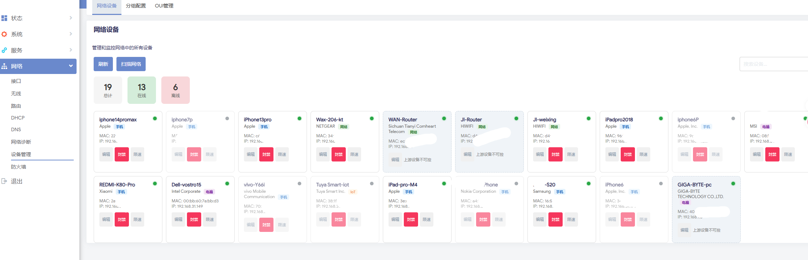

# OpenWrt DeviceMaster

增强型 OpenWrt 设备管理插件 - 支持最新版 OpenWrt 24.1 / 25.12

## 关于本项目

本项目由 [small-white-rabbit](https://github.com/small-white-rabbit) 使用 AI 辅助工具构建。

> **注意**：本项目为个人学习作品，如遇 Bug 或问题，请自行寻找 AI 工具解决，或提交 Issue 讨论。

## 功能特性

### 🔍 智能设备识别
- **MAC OUI 查询**: 通过 IEEE OUI 数据库识别设备厂商（Apple、Samsung、Xiaomi、Huawei 等）
- **多源识别**: 支持本地数据库查询、远程 API 查询、主机名模式匹配、mDNS/Bonjour 探测
- **设备类型分类**: 自动分类为手机、电脑、IoT设备、网络设备
- **随机 MAC 检测**: 识别本地管理地址（LAA），标记隐私保护设备

### 📝 设备管理
- **自定义命名**: 为设备设置自定义名称，支持自动去重
- **双向同步**: 名称自动同步到 dnsmasq，在原生 DHCP 租约列表中显示  
  > <span style="color:red">**注意**：dnsmasq 不支持中文字符作为主机名。包含非英文字符的名称会被过滤后同步（如"我的手机"→"-"），纯中文名称则不会同步到 dnsmasq，将保留设备原有的主机名不变。中文名称仅在 DeviceMaster 插件内正常显示。</span>
- **备注功能**: 为设备添加备注信息
- **设备分组**: 将设备组织到自定义分组中

### 📊 设备监控
- **在线状态**: 实时监控设备在线/离线状态（基于 ARP 表和 ip neigh）
- **设备发现**: 自动发现新接入网络的设备
- **网络扫描**: 主动扫描网段发现未识别设备

### 🛡️ 流量控制
- **一键封禁**: 通过 nftables 快速屏蔽设备网络访问
- **带宽限速**: 使用 tc (Traffic Control) 限制设备网速，支持 nftables 降级方案
- **定时规则**: 设置定时封禁/限速规则，支持按分组生效

### ⚙️ OUI 数据库管理
- **远程查询**: 支持 maclookup.app、macvendors.com 等 API
- **本地数据库**: 支持下载完整 IEEE OUI 数据库离线使用
- **缓存机制**: 自动缓存查询结果，减少重复请求

## 编译方法

### 方法一：集成到 OpenWrt 源码编译

```bash
# 1. 进入 OpenWrt 源码目录
cd openwrt

# 2. 复制插件到 package 目录
cp -r luci-app-devicemaster feeds/luci/applications/

# 3. 更新 feeds
./scripts/feeds update luci
./scripts/feeds install luci-app-devicemaster

# 4. 配置编译选项
make menuconfig
# 选择 LuCI -> Applications -> luci-app-devicemaster

# 5. 编译
make package/luci-app-devicemaster/compile V=s
```

### 方法二：使用 OpenWrt SDK

```bash
# 1. 下载对应版本的 SDK
# 从 https://downloads.openwrt.org/ 选择对应版本

# 2. 解压并进入 SDK 目录
tar xf openwrt-sdk-*.tar.xz
cd openwrt-sdk-*

# 3. 复制插件源码
cp -r luci-app-devicemaster package/

# 4. 编译
make package/luci-app-devicemaster/compile V=s
```

## 安装方法

### 从 IPK 安装

```bash
# 上传 ipk 文件到路由器
scp luci-app-devicemaster_*.ipk root@192.168.1.1:/tmp/

# 安装
opkg install /tmp/luci-app-devicemaster_*.ipk

# 重启 rpcd 和 uhttpd
/etc/init.d/rpcd restart
/etc/init.d/uhttpd restart
```

### 手动安装

```bash
# 复制文件到路由器
scp -r root/* root@192.168.1.1:/
scp -r luasrc/* root@192.168.1.1:/usr/lib/lua/luci/

# 设置权限
chmod +x /etc/init.d/devicemaster
chmod +x /usr/libexec/devicemaster/*

# 运行初始化脚本
sh /etc/uci-defaults/90_devicemaster

# 启动服务
/etc/init.d/devicemaster enable
/etc/init.d/devicemaster start
```

### 卸载

通过 IPK 安装的插件，`opkg remove` 会自动清理所有残留配置和数据：

```bash
opkg remove luci-app-devicemaster
```

手动安装的插件，运行以下命令完整卸载：

```bash
/etc/init.d/devicemaster service_cleanup
/etc/init.d/rpcd restart
/etc/init.d/uhttpd restart
```

卸载时会自动清除：UCI 配置、DHCP 静态绑定、nftables 规则、OUI 数据库、运行时缓存等所有残留数据。

## 使用说明

### 界面预览

**设备列表页面：**



### 访问界面

安装后，在 LuCI 界面中访问：
- **网络 → 设备管理 → 网络设备**: 查看和管理所有设备
- **网络 → 设备管理 → 分组配置**: 管理设备分组和定时规则
- **网络 → 设备管理 → OUI管理**: 配置 OUI 查询模式和数据库

### 设备操作

1. **编辑设备**: 点击设备卡片的"编辑"按钮，设置自定义名称、厂商、类型和分组
2. **封禁设备**: 点击"封禁"按钮，立即断开该设备的网络连接
3. **限速设备**: 点击"限速"按钮，输入限速值（如 1mbit, 512kbit）

### 分组管理

1. 创建分组并设置名称
2. 在设备编辑界面将设备分配到分组
3. 设置定时规则，按分组自动执行封禁或限速

### OUI 数据库配置

- **远程模式**（默认）: 按需查询在线 API，内存占用低
- **本地模式**: 下载完整数据库，查询更快但占用存储空间

## 依赖项

必需：
```
luci-lib-base
luci-lib-jsonc
libubus-lua
nftables
```

可选（用于限速功能）：
```
tc-full
kmod-sched-core
```

可选（用于 mDNS 探测）：
```
avahi-daemon
avahi-utils
```

## 目录结构

```
luci-app-devicemaster/
├── Makefile                          # OpenWrt 编译配置
├── luasrc/
│   ├── controller/
│   │   └── devicemaster.lua          # 控制器（API 端点）
│   ├── model/cbi/
│   │   └── devicemaster/
│   │       └── settings.lua          # OUI 管理页面
│   └── view/
│       └── devicemaster/
│           └── devices.htm           # 设备列表视图
├── root/
│   ├── etc/
│   │   ├── config/
│   │   │   └── devicemaster          # UCI 配置文件
│   │   ├── init.d/
│   │   │   └── devicemaster          # 服务初始化脚本
│   │   └── uci-defaults/
│   │       └── 90_devicemaster       # 安装后初始化脚本
│   └── usr/
│       ├── libexec/devicemaster/
│       │   ├── devicemasterd         # 主守护进程
│       │   ├── device_collector.sh   # 设备数据采集与识别
│       │   ├── device_monitor.sh     # 设备在线监控
│       │   ├── traffic_control.sh    # 流量控制（封禁/限速）
│       │   ├── oui_lookup.sh         # OUI 查询模块
│       │   └── sync_hostname.sh      # dnsmasq 同步脚本
│       └── share/
│           ├── devicemaster/
│           │   ├── oui.txt           # OUI 厂商数据库
│           │   └── oui_append.txt    # 自定义 OUI 补充
│           └── rpcd/acl.d/
│               └── luci-app-devicemaster.json  # ACL 配置
└── po/
    └── zh_Hans/
        └── devicemaster.po           # 中文翻译
```

## 技术架构

```
┌─────────────────────────────────────────────────────────────┐
│                    LuCI Frontend (JS/HTML)                   │
│                     devices.htm / groups.js                  │
└─────────────────────────┬───────────────────────────────────┘
                          │ HTTP/JSON-RPC
┌─────────────────────────▼───────────────────────────────────┐
│                 LuCI Controller (Lua)                        │
│              devicemaster.lua (API Handler)                  │
└─────────────────────────┬───────────────────────────────────┘
                          │ Shell Exec
┌─────────────────────────▼───────────────────────────────────┐
│                  Backend Scripts (Shell)                     │
│  ┌────────────────┐ ┌────────────────┐ ┌────────────────┐   │
│  │device_collector│ │  traffic_control│ │   oui_lookup   │   │
│  │     .sh        │ │     .sh        │ │     .sh        │   │
│  └───────┬────────┘ └───────┬────────┘ └───────┬────────┘   │
└──────────┼──────────────────┼──────────────────┼────────────┘
           │                  │                  │
┌──────────▼──────────────────▼──────────────────▼────────────┐
│                    System Resources                          │
│  /tmp/dhcp.leases  /proc/net/arp  nftables  tc  UCI         │
└─────────────────────────────────────────────────────────────┘
```

## 常见问题

### Q: 设备列表为空？
A: 确保 dnsmasq 正在运行，且有设备已连接到路由器。点击"扫描网络"按钮主动发现设备。

### Q: 无法封禁设备？
A: 检查 nftables 是否正常工作：`nft list tables`。确保内核支持 nftables。

### Q: 限速不生效？
A: 确保 tc 和相关内核模块已安装：`opkg install tc-full kmod-sched-core`。如不可用，插件会自动降级使用 nftables 限速。

### Q: 名称同步不生效？
A: 检查 dnsmasq 配置是否正确写入：`uci show dhcp | grep host`。重启 dnsmasq：`/etc/init.d/dnsmasq restart`

### Q: 厂商识别不准确？
A: 在 OUI 管理页面下载本地数据库，或切换远程 API 接口。对于随机 MAC 设备，可手动设置厂商信息。

## 许可证

GPL-2.0-only

## 贡献

欢迎提交 Issue 和 Pull Request！

## 致谢

- OpenWrt 项目
- LuCI 项目
- IEEE OUI 数据库
